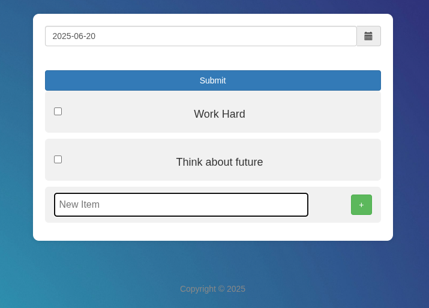

This is the Do-Day :rocket:  Website Created for the purpose Marking your daily regular activities.

I have included the Preview of this website

---



---

# Prerequisites
Download *Node.js* and *npm* in your machine
you can check the version by 
`node -v` and `npm -v`

---

# How to run this project 

## Step - 1. Clone this Repository
`git clone https://github.com/ArunDharani/Do-Day.git`

## Step - 2. Please Install npm packages by running
Run this command to enter into the folder `cd Do-Day`
Run `npm install` to install all the necessary packages

## Step - 3. Create a .env file inside the Do-Day Folder
`touch .env`

## Step - 4. Add the following inside the env file
First run `nano .env`

Now you can change the credentials as per your data
```
PORT= "your wish"
DB_HOST= "you can also change this"
DB_PORT= "your db port"  
DB_USER= "postgres"
DB_PASS= "yourpassword"
DB_NAME= "yourdbname"

```
For the above you can provide your own credentials

## Step - 5. Create table in your database in the form 
```
CREATE TABLE dolist (
  id SERIAL PRIMARY KEY,
  title TEXT NOT NULL,
  today DATE NOT NULL
);
```

## Step - 6. Finally Run the command 
```node Main.js```

To get website to run

---

## Step - 7. Now run the below command (only if you give DB_HOST as localhost)
`localhost:PORT`
For the PORT you give the value you gave in .env file

---


---

Fell Free to provide or make any changes 
If you like to contribute 
Fork this repo 
and perform the necessary drills to make changes 
